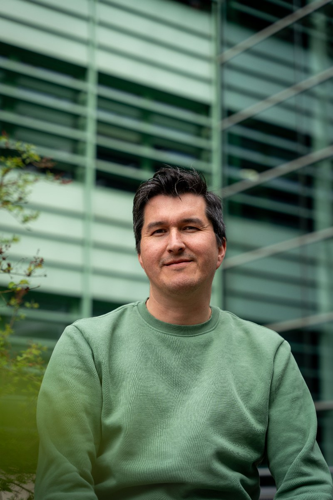

::: {.hero-card}

::: {.hero-left}
{.profile-photo fig-alt="Photo of Félix P. Leiva"}

::: {.hero-name}
# Félix P. Leiva
:::

::: {.hero-title}
Postdoctoral Researcher
:::

::: {.hero-affil}
[Radboud University](https://www.ru.nl/personen/leiva-leiva-f)
:::

::: {.social-icons}
[](mailto:felixpleiva@gmail.com "Email")
[](https://scholar.google.com/citations?user=Cgm7_bMAAAAJ "Google Scholar")
[](https://orcid.org/0000-0003-0249-9274 "ORCID")
[](https://github.com/felixpleiva "GitHub")
[](https://bsky.app/profile/felixpleiva.bsky.social "Bluesky")
:::

:::

::: {.hero-right}
# Biography

I am from Chile 🇨🇱, where I grew up as an artisanal fisherman, catching Southern hake and other delicious fish. I started working as fisherman when at the age of 12, spending my summer and winter school holidays at sea. Even now, those early days still bring a lump to my throat — a source of great pride and good memories.

My research primarily focuses on **macrophysiology**, complemented by elements of experimental **ecophysiology**, though this plays a smaller role in my work nowadays. These approaches enable me to uncover how animals thrive and adapt to ever-changing environmental conditions, across space and time.
:::

:::

::: {.two-col}

::: {.col}
## Interests

 Macrophysiology  
 Scaling of traits  
 Reproducible scientific workflows  
:::

::: {.col}
## Education

::: {.timeline}
-  **PhD in Science**, 2022   *Radboud University, the Netherlands*
-  **Aquaculture Engineer**, 2011   *Universidad Austral de Chile, Chile*
-  **Bachelor in Science and Technology**, 2007   *Universidad Austral de Chile, Chile*
:::
:::

:::

